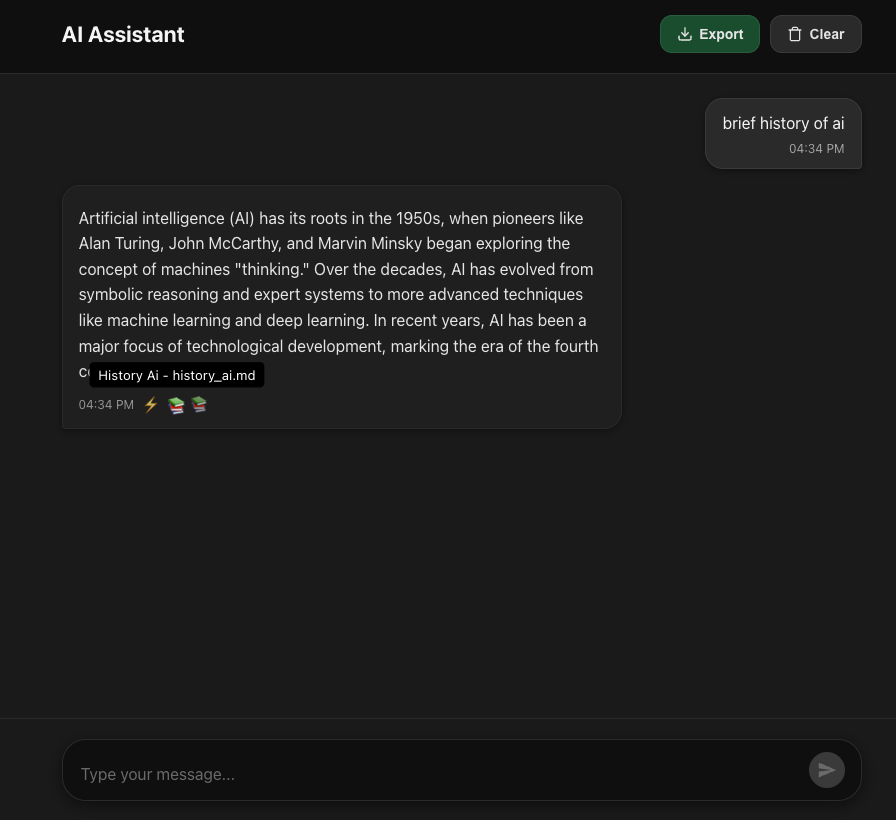

# 🤖 AI Assistant Demo



> Production-ready AI assistant with intelligent routing, RAG with source citations, and a beautiful React TypeScript frontend.

**Smart routing:** 95% of queries use simple RAG. Multi-agent research workflow triggers only when you explicitly ask for a comprehensive report.

## 🚀 Features

- **Intelligent Routing** - GPT-4o-mini classifies queries as simple or research
- **RAG with Citations** - Automatic Pinecone vector search with source documents
- **Multi-Agent Research** - Planner → Gatherer → Report Builder workflow
- **Real-time Streaming** - Token-by-token responses via Server-Sent Events
- **Export to Markdown** - Download conversations with sources and metadata
- **Beautiful UI** - Dark theme with mode indicators and expandable sources

**Tech Stack:** React, TypeScript, FastAPI, LangGraph, OpenAI GPT-4, Pinecone, Tavily

## ⚡ Quick Start

```bash
# 1. Setup environment files
cp api/env.example api/.env
cp ingest/env.example ingest/.env
# Edit both .env files with your API keys (OpenAI, Pinecone, Tavily optional)

# 2. Ingest knowledge base
cd ingest
pip install -e .
python -m core.setup
python -m core.ingest

# 3. Start services
cd ..
make start

# Or with Docker:
docker-compose -f docker-compose.dev.yml up
```

**Access:**
- UI: http://localhost:3000
- API: http://localhost:8000
- Docs: http://localhost:8000/docs

## 📖 Usage

**Simple queries** (automatic RAG):
- "What is deep learning?"
- "How does AI support exploring Mars?"

**Research mode** (multi-agent):
- "Write a comprehensive report on AI in healthcare"
- "Research quantum computing and create a detailed report"

## 🧪 Testing

```bash
cd ui && npm test        # Frontend tests
cd api && pytest         # Backend tests
cd ingest && pytest      # Ingest tests
```
